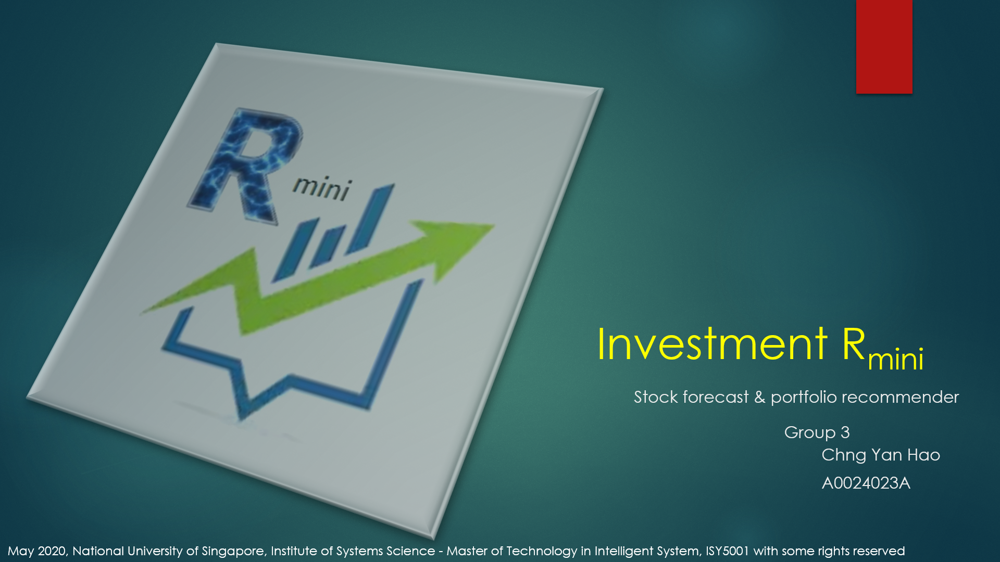

## SECTION 1 : PROJECT TITLE
## Investment Rmini - Stock Forecast & Portfolio Recommender `Under Construction`

---

## SECTION 2 : EXECUTIVE SUMMARY

---

## SECTION 3 : CREDITS / PROJECT CONTRIBUTION

| Official Full Name  | Student ID (MTech Applicable)  | Work Items (Who Did What) | Email (Optional) |
| :------------ |:---------------:| :-----| :-----|
| Chng Yan Hao | A0024023A | from 0% to 100% | E0529228@nus.edu.sg |

---

## SECTION 4 : VIDEO OF SYSTEM MODELLING & USE CASE DEMO

<[>

<Note: It is not mandatory for every project member to appear in video presentation; Presentation by one project member is acceptable.>
<More reference video presentations [here](https://telescopeuser.wordpress.com/2018/03/31/master-of-technology-solution-know-how-video-index-2/ "video presentations")>

---

## SECTION 5 : USER GUIDE

`Refer to appendix <Quick User Guide> in project report at Github Folder: ProjectReport`

### Able to run standalone:

> download .zip from SystemCodes and unzip
> begin by running Investment_Rmini.xlsm

### Recommended: 
> Internet connection (for data download)
> Windows 10
> Microsoft Visual Basic for Applications enabled; Microsoft Excel 
> Microsoft Solver Add-in & library enabled in VBA environment 
> R 3.6.3; packages: forecast; ggplot2; ggpubr & their dependencies

---
## SECTION 6 : PROJECT REPORT / PAPER

`Refer to project report at Github Folder: ProjectReport`

**Recommended Sections for Project Report / Paper:**
- Executive Summary
- Business Problem Background
- Project Objectives
- Project Solution
- Project Implementation
- Project Performance & Validation
- Project Conclusions: Findings & Recommendation
- Appendix of report: Flow Diagram
- Appendix of report: Quick User Guide
- Appendix of report: Project Journey

---
## SECTION 7 : MISCELLANEOUS

`Refer to Github Folder: Miscellaneous`

* Investment_Rmini.png
* Executive_Summary.png
* Workable .csv samples for csv folder

---

### <<<<<<<<<<<<<<<<<<<< End of Template >>>>>>>>>>>>>>>>>>>>

---

**This [Machine Reasoning (MR)](https://www.iss.nus.edu.sg/executive-education/course/detail/machine-reasoning "Machine Reasoning") course is part of the Analytics and Intelligent Systems and Graduate Certificate in [Intelligent Reasoning Systems (IRS)](https://www.iss.nus.edu.sg/stackable-certificate-programmes/intelligent-systems "Intelligent Reasoning Systems") series offered by [NUS-ISS](https://www.iss.nus.edu.sg "Institute of Systems Science, National University of Singapore").**

**Lecturer: [GU Zhan (Sam)](https://www.iss.nus.edu.sg/about-us/staff/detail/201/GU%20Zhan "GU Zhan (Sam)")**

**zhan.gu@nus.edu.sg**
